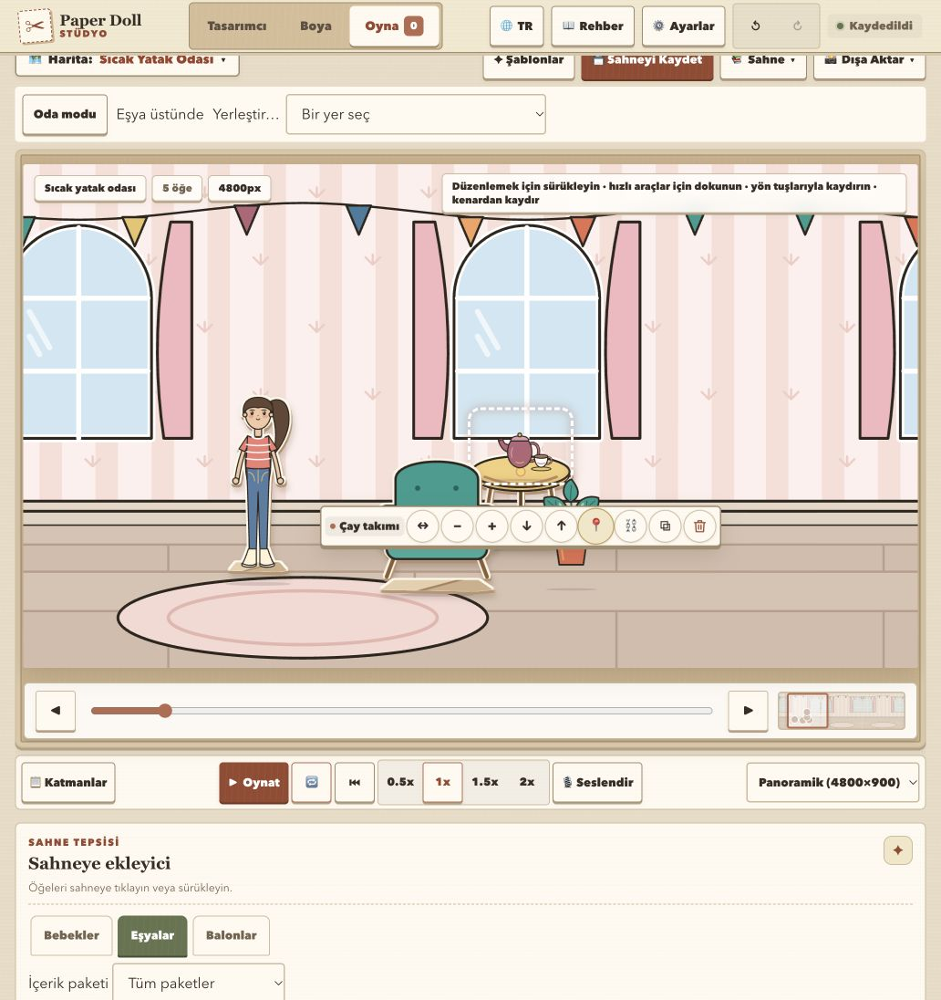

# Depth and surface placement review

Date: 2026-10-01. Reviewed the current working tree against `docs/PRD-DEPTH-AND-SURFACE-PLACEMENT.md`, D-049, and the referenced “Design depth-aware scene placement” chat. The findings below record the initial review before remediation.

**Remediation:** R1 and R3–R12 are addressed in the working tree, with regression tests. R2 is retired by the authorized schema-8 clean start: old artwork arrangements are discarded rather than migrated. The user mode toggle and migrations are removed. Shrink confirmation, same-surface duplicates, explicit furnished copies, floor recovery on deletion, content validators, trapezoid taper, and authoring steppers are implemented.

**Remaining scope:** selected-instance artwork replacement, occlusion-aware pointer targeting, additional invalid-ghost explanations, a vase test sample, physical iPad/pilot/performance checks. See D-050 and the PRD amendment. Wall/floor polygons already separate placement semantics; background image splitting is optional for later foreground occlusion or visual customization.

**Initial verdict:** the foundation worked, but the complete original PRD was not satisfied.

## Remediation verification

- `npm run check` passed after the fixes: **578 tests, 0 failures**, TypeScript,
  document/asset/pack/cache validators, and ESLint with **91 existing warnings,
  0 errors**. Added regression coverage lives in `test/paper-stage-fixes.test.js`.
- Real browser: automatic room startup has no setup undo entry; the welcome
  objects use floor placement. Placing tea on a table and pinning disables its
  destination chooser. The table exposes Duplicate with contents.
- Real browser shrink: moving the table to the second panorama region previews
  exactly **2** removals (table plus pinned tea). Cancel restores the width picker
  and preserves both; Yes removes both; Undo restores the assembly and pin.
  [Confirmation screenshot](paper-stage-shrink-confirmation.png).
- Real browser authoring: Add trapezoid exposes rear width and movement/size
  steppers. Arrow-down edits rear width from 210 to 209 while retaining focus.
  Both browser previews reported no console errors or warnings.
- Physical iPad, moderated child-user authoring, crowded-scene performance,
  and a complete newly drawn furniture save/export round trip remain unverified.

## Initial verification

- `npm run check` passed: **554 tests, 0 failures**, TypeScript, document/asset/pack/cache validators, and ESLint with **91 warnings, 0 errors**.
- Executed additional Node probes against the actual domain functions, schema sanitizer, and AppStore. The observations below come from those executions, not hypothetical scenarios.
- Browser smoke check at a separate local preview origin: Room conversion, tray spawning, Outline selection, and Place on tabletop worked. The pinning failure also reproduced through the real UI.
- Reviewed drawing authoring, metadata history/cropping, preview, export, import, and background code. Did not run a complete custom-art save/export round trip, physical iPad testing, or frame-time benchmarks. The passing suite does not establish those results.

## Findings

Severity: P1 = fix before release because existing arrangements or core editing break; P2 = correctness/accessibility gap worth fixing in this milestone; P3 = lower-impact contract defect.

### R1 — P1: supported items cannot be pinned

Location: `js/domain/scene-rules.js:268–271`.

`setEntityPinned(scene, childId, true)` on a surface child returns `pinned: false`. The conditional skips the generic detach branch, then falls through to the unpin return. Browser evidence: after placing the tea set on a table and clicking Pin, the success message says it was pinned, while the toolbar still offers Pin and Place on remains enabled.

Preserve `attachedTo`, placement, and offsets, and write the requested pin value. Verify direct edits are locked but parent movement still carries the pinned child. PRD A9/D-049.

### R2 — P1: the painting anchor change moves legacy artwork

Location: `js/core/asset-catalog.js:466`.

The catalog changes `prop_painting` from a bottom-center to a center anchor for every scene, including schema-6 Free collage scenes. Migration changes placement mode but does not compensate the contact coordinate. At scale 1, a painting saved at `(800, 500)` previously occupied Y `320–500`; it now occupies `410–590`: a **90 logical-pixel shift**. Schema migration therefore preserves coordinates but not the visual arrangement.

Keep the legacy anchor or migrate all affected current/saved-scene coordinates with scale-aware compensation and attachment handling. Verify stage, thumbnail, and export. PRD A11.

### R3 — P1: asymmetric flipped props jump on reload

Location: `js/core/state-schema.js:534–535`.

Sanitation calls the old unflipped `clampPoint` before placement recovery. Placement's visual-bound math correctly reflects an asymmetric anchor, but sanitation does not. A 200-wide flipped custom floor prop with anchor X `.9` can validly be placed at X `50`; `sanitizeScene` changes it to X `180`. Any supported contents follow the unwanted displacement.

Use the same flip-aware bounds and tolerance policy for live commands and sanitation. Add a save/load test, rather than only a project/unproject algebra test. PRD A10/A18.

### R4 — P2: group movement changes the arrangement at boundaries

Location: `js/domain/scene-rules.js:715–720`.

Selected roots are moved and clamped separately. Two floor tables at X `200` and `800`, moved by requested delta `−500`, actually move by `−75` and `−500`. The scene commits with different spacing. Pointer multi-selection uses this same function.

Compute feasibility for the complete selection and accept one shared delta or reject the operation atomically. Parent/child root normalization already helps avoid double movement, but it does not solve independent-root feasibility. PRD section 9.

### R5 — P2: Free collage still rejects valid furniture transforms

Location: `js/domain/scene-rules.js:835–843`.

After changing a furnished table to Free collage and moving its contact to Y `500`, flipping it returns the unchanged scene. The table fits the stage and its tea set fits its tabletop, but transform validation still requires its old floor target. Surface support must remain enforced in Free mode; room floor/wall constraints must relax. Current validation also scans unrelated entities, so another invalid placement can prevent an otherwise valid edit.

Validate the affected assembly under the active mode. PRD section 5.3.

### R6 — P2: shrinking a pinned panorama fixture leaves a stale region

Location: `js/core/reducers/scene-reducer.js:83–90`, `js/domain/scene-rules.js:808–823`.

A pinned table on `floor:2` at X `4000` in a 4800-wide room shrinks to X `1475` on a 1600-wide stage, but still references `floor:2`. Reload converts it into a `no-valid-target` free exception. Its supported child remains attached. The visible floor placement and the persisted region disagree.

Use placement-aware assembly relocation even for pinned roots, update the region atomically, and preview relocation before the width change. PRD A14.

### R7 — P2: host scale/flip leaves generic descendants behind

Location: `js/domain/scene-placement.js:110–118`, called by `transformPlacedEntity`.

A camera generically attached to a supported tea set stays at X `820` when flipping the table moves the tea from X `830` to `770`. The camera still stores offset `−10`, but its actual offset becomes `+50`. Surface recovery changes direct surface children without propagating their displacement to generic descendants. Static attachment rendering does not repair that absolute-position drift.

Evaluate affected relationships in graph order and propagate descendant deltas while keeping generic attachment semantics. Verify both scale and flip with a generic grandchild. PRD A4/A9 and section 9.

### R8 — P2: unavailable artwork still provides usable support

Location: `js/domain/scene-placement.js:33–38`.

Changing the table descriptor to `status: 'missing'` and running recovery keeps its tea set in surface placement. Target enumeration never checks asset availability. Missing custom-art descriptors and missing-pack placeholders retain metadata, so checking only whether the entity exists is insufficient.

Exclude unavailable support artwork from usable targets and preserve children in the specified recovery state; restoring artwork should not silently relink them. PRD A7.

### R9 — P2: newly acquired drag candidates have no release hysteresis

Location: `js/features/play/stage-pointer-controller.js:199–202`.

Every pointer preview resolves against the committed scene, rather than the preceding transient candidate. A floor item previews on a table at distance `10`, then drops back to floor at distance `20`, even though the promised release threshold is `24`. The 24-pixel threshold works only for an already committed current support.

Keep transient candidate state for the gesture; clear it on commit/cancel. Verify threshold behavior at multiple viewport scales. PRD section 8.1.

### R10 — P2: placement controls destroy keyboard focus

Location: `js/features/play/placement-controls.js:28`; also `js/features/paint/paint-placement-controller.js:89`.

Play replaces the entire control subtree on every render. Using the destination chooser dispatches a state update and removes the focused select. Paint similarly replaces its numeric inputs on each metadata commit; its focus restoration only covers SVG surface/anchor nodes. This breaks a continuous keyboard workflow and can disrupt click/tap adjustment.

Patch stable controls or restore the exact control and editing context after updates. Check keyboard destination selection followed by movement, and consecutive numeric authoring edits. PRD A15/A29.

### R11 — P2: bedroom floor geometry includes the skirting strip

Location: `js/core/asset-catalog.js:456` and `scripts/backgrounds/interiors.mjs:102–105`.

The bedroom placement floor starts at Y `620`; the floorboards start at Y `646`, after a 26-pixel vertical baseboard. A table dragged upward stops around Y `622.3`, with its contact inside the skirting strip. Atelier and cafe use the lower edge of their baseboards (`664` and `666`).

Align the bedroom profile with the actual floor plane. Share authored floor-edge metadata with the background generator so art and placement cannot drift independently. PRD A1/section 5.2.

### R12 — P3: selection fallback is calculated but ignored for batch flip

Location: `js/core/reducers/scene-reducer.js:337–341`.

Dispatching `scene/flipEntities` without explicit IDs computes the selected IDs, then passes `action.instanceIds` instead. The result is a no-op. Current toolbar actions pass explicit IDs, so their ordinary path works; the reducer's existing selection-fallback contract regressed.

Pass `targetIds` and verify both explicit and selection-derived actions.

## PRD work still pending or different

| Requirement | Current behavior | Next step |
| --- | --- | --- |
| Duplicate supported lamp retains its host when it fits | Duplicating supported tea clears support and places the copy on the floor | Find a fitting point on the current host, or offer a destination |
| Host-only duplicate by default, explicit Duplicate with contents | Furnished hosts automatically duplicate all descendants | Add the explicit action or approve and document a product change |
| Delete host prefers a valid floor fallback | Every supported child becomes a support-missing free exception | Attempt allowed fallback first; retain exception only when needed |
| Trapezoid Rear width/taper control | Trapezoid uses fixed 15% inset; no rear-width field | Add taper control and stable round-trip geometry |
| Click/tap-only Move/Resize steppers and choose preset center | Numeric controls exist, but presets immediately spawn at a fixed point and there are no labeled steppers | Complete the intended touchscreen alternative and test thin surfaces |
| Try-it preview with lamp/vase and destination controls | Lamp only; automatic placement on the selected surface; host can move | Finish preview interactions or explicitly narrow the accepted requirement |
| Selected-piece replacement with impact preview/undo | Edit Copy saves a separate asset; Save & Use spawns another prop | Complete selected-host replacement, preserving/recovering children; A28 remains pending |
| Only visible supports acquired by dragging | Candidate scan does not test occlusion | Filter wholly occluded targets during dragging; keep chooser access |
| Placement ghost/contact marker and accessible invalid reason | Legal polygon is highlighted, with no full ghost/marker/reason flow | Add usable feedback; generic “invalid” messages do not explain fit/type failures |
| Asset/pack geometry validation | Custom metadata is validated; existing catalog/pack validators do not validate placement rules, unique background region IDs, or support polygons | Extend build-time validators and add malformed-profile cases |

Mixed-support alignment currently returns unchanged state without the requested explanation. Wall-specific contact shadows are also absent from the shared shadow helper. These are smaller parity/feedback gaps.

## Should the background be split into floor and wall?

**Semantic separation already exists:** each enabled background supplies separate floor and wall polygons. The three enabled rooms are bedroom, atelier, and cafe; other backgrounds intentionally remain Free collage.

**Separate image files are optional.** Current depth ordering works with one background image because every live entity renders above it. Splitting files alone does not improve depth or fix the defects above.

The useful next step is a shared authored room definition containing the actual floor edge and stable regions. The generator can emit named SVG groups such as wall, trim, floor, and fixed decor, while retaining one composed background. Validate the profile against those dimensions, including mirrored panorama tiles.

If players should independently choose floor and wallpaper, split their composition into reusable layers and define compatible seams. If dolls should pass behind room fixtures, introduce explicit foreground/occlusion layers or editable prop entities: a fixture painted into a single background always stays behind every entity. If dolls should sit inside sofas or pass between table parts, author front/back furniture artwork and explicit pose/support rules. Wall/floor splitting does not provide that behavior, and the PRD deliberately defers it.

Keep the current approach free of a physics/3D dependency. It can support the proposed paper-stage behavior once the state, geometry, and UI issues are fixed.

## Recommended delivery order

1. **Correctness and migration:** R1–R8, especially legacy painting preservation and flip-aware reload. Verify with behavioral regressions plus real save/reload/export scenarios.
2. **Interaction completeness:** focus, drag hysteresis, shared-delta selection, duplicate/delete/replace behavior, authoring taper/steppers, and explicit feedback. Decide and record intentional PRD reductions.
3. **Content:** correct bedroom floor geometry, share floor-edge data with generated art, author more rooms and individually classify Family & Home props. Add foreground layers only for a concrete occlusion need.
4. **Release evidence:** English/Turkish, keyboard and touch-only authoring, thin/overlapping supports, offline reload, portrait/landscape physical iPad Safari, and screenshot comparisons of Play/Scene Book/PNG. Benchmark 20- and 40-entity furnished scenes with recorded frame times and worst interaction tasks. Complete the five-user pilot.

Do not mark the full PRD complete based on unit tests alone. The existing 13 depth-placement and 5 paint-placement tests exercise useful happy paths, but do not cover the reproduced failures or the complete browser acceptance matrix.

