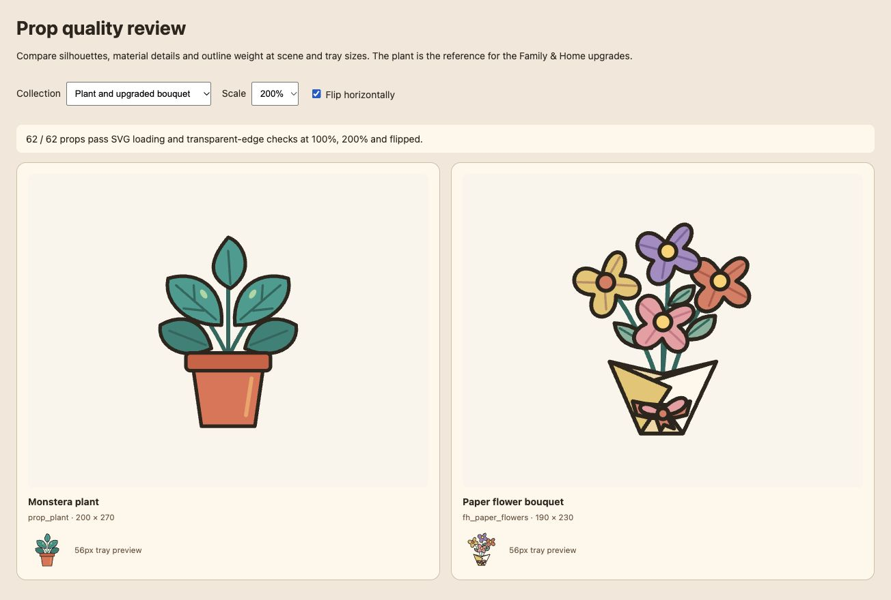

# Prop quality audit — 2026-10-01

Reviewed the 22 core and 40 Family & Home props. The core plant establishes the
reference: a dark, rounded 16-unit silhouette, connected parts, clear solid
colors, and a few lighter material details that survive small previews.

The Family & Home pack used 5-unit outlines throughout, so it looked faint
beside core props. All 40 pack props now use the core outline and a coordinated
warm palette. Narrow crib rails, seams, leaf veins and other interior marks use
lighter strokes so detail does not overpower the silhouette.

## Rebuilt designs

- Paper bouquet: folded petals, centers, leafy stems, overlapping kraft wrap
  and a tied ribbon replace the oval flowers and empty triangular wrapper.
- Teddy: arms, ear and paw pads, stitched patch, mouth and fabric bow.
- Sofa and pram: upholstery seams, frame thickness, wheel hubs and fabric details.
- Reading lamp and serving tray: constructed stand and open handles.
- Cocoa mugs: open handles, inset drink surfaces, marshmallows and steam.
- Popcorn: irregular kernels and a striped carton with a paper badge.
- Mobile: suspended moon, distinct stars and beads connected to the frame.
- Gifts: dimensional lids, looped bows, wrapping details and a tag.
- Wreath: individually shaped leaves, veins, berry clusters and a fabric bow.
- Snow globe: layered evergreen, snow, ornaments, glass reflection and base trim.
- Cushions and portrait: stitched patchwork and recognizable smiling family faces.
- Blanket fort: folded curtains, ties, connected lights and cushions inside.
- Candy bowl: wrapped sweets with two twists, bowl rim and ceramic highlight.

The other 24 pack props retain their silhouettes with tailored material and
construction details: woven baskets, block motifs, book pages, seams, bottle
markings, stitching, game pieces, pennant decorations and cookie chips.

Asset IDs, viewBoxes, catalog dimensions and placement anchors are preserved,
so saved scenes resolve the upgraded artwork without migration.

## Review

Serve the repository and open [the prop quality review](prop-quality.html).
It includes all 62 props, scene aspect ratios, 56px tray previews, 200% scale
and horizontal flipping. The page uses the runtime SVG loader and checks for
empty images or artwork touching any source edge at both scales and orientations.
These checks cover loading and clipping; silhouette and material quality still
require visual review.

Verified in the local browser: all 62 assets load and pass the four raster edge
checks; all 40 upgraded props were visually reviewed in the pack gallery. The
plant/bouquet comparison was checked at 200% and flipped. The project check
passed with 580 tests, no failures, and passing asset, pack, documentation,
type and cache validation. Existing ESLint advisory warnings remain.
The six existing Family & Home story thumbnails were also checked with the
upgraded artwork.

The existing [Family & Home review](family-home.html) also shows the upgraded
props and the six story scenes. Keep new props consistent with the reference
at tray and stage size, rather than judging them only as large standalone SVGs.
